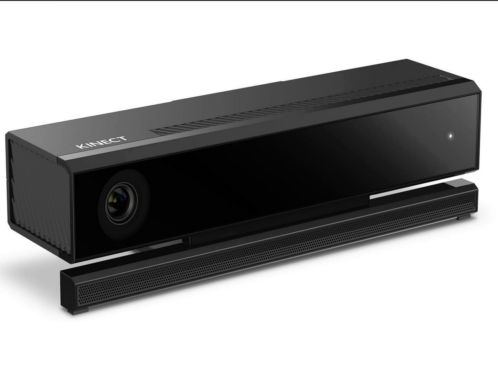

# Virtual_Trial_Room

### Virtual trial room Project Done in shrishti 2018

## Abstract

Virtual trial room is a simple human machine interface. The basic idea for designing virtual trial room was to give user a interface to virtually try the dresses of his/her choice. I have used Xbox Kinect as my sensor to detect body movements and gestures. I used processing for frontend interface.

## Setup

Install Processing Software & Kinect SDK from internet. Connect kinect to your PC. Let it install the driver automatically. Write your code on Processing and Run It!!!.

## Applications:

Everytme when we shop some dresses/clothes, how is that if we try them virtually wihout even unfolding them. So here we come with a solution to give user/customer an idea of dressing the clothes virtually. All one has to do is give simple gestures to select various options. It is very potent to give an awesome feeling of trying dresses virtually Indirectly saying we have just hacked Xbox Kinect (which can only be used to play games) for various human activities.

## Requirements

1\. Xbox Kinect (Microsoft Product)  
 2\. Laptop with high graphic quality(at least 4GB graphic card)  
3\. Processing software(Open source software)  

## Libraries Used

Processing has inbuilt libraries for kinect, just download it from internet. Required libraries are:- . Kinect V2 for Processing - Kinect v2 implementation using the Kinect Windows SDK . Kinect4WinSDK - A simple wrapper for the Microsoft Kinect for Windows SDK version 1.8 . Sound - Sound library based on MethCla for Processing These libraries have inbuilt code examples for detecting body, body depth, body joint coordinates, colour image.

## About

 Kinect uses Infrared sensors, microphone and video camera to draw exact coordinate (x,y,z) of joints of our body which is the most helpful feature. The optimum range for detection of full body joint is 2.5 to 3 meters. We can recognise voice, gesture, hand state etc.  Processing Software was developed by MIT, just for the purpose of animation, game designing, effect designing etc. It uses basic java with inbuilt classes, methods and function for easy sketching and designing. The basic layout contain two functions i.e. setup (run once) and draw (loop).

## Code

https://github.com/Shreeyash-iitr/Virtual_Trial_Room/blob/master/Project.pde

### Code Explaination

Import all libraries at the begining of code. In void setup(), define varilbles for different dresses.Main body tracking part comes under void draw(). There are three pages- starting page, menu page and finally execution page for which switch()-cases have been used. Also write separate functions for executing common things like sound files.

## Future improvements

This projects only have 2D dresses which is a major drawback. An approach should be made to make 3D virtual trial room.

## Video lectures

https://www.youtube.com/watch?v=QmVNgdapJJM&list=PLRqwX-V7Uu6ZMlWHdcy8hAGDy6IaoxUKf

## Team members

> [Shreeyash Geda](https://www.facebook.com/shreeyash.geda.1),  
> Omkar,  
> Yashutosh,  
> Dhruv,  
> Mohit

## Mentors

> [Shivam maloo](https://github.com/Kakashi08),  
> [Bhavya Giri Goswami.](https://www.facebook.com/bhavya.girigoswami)
